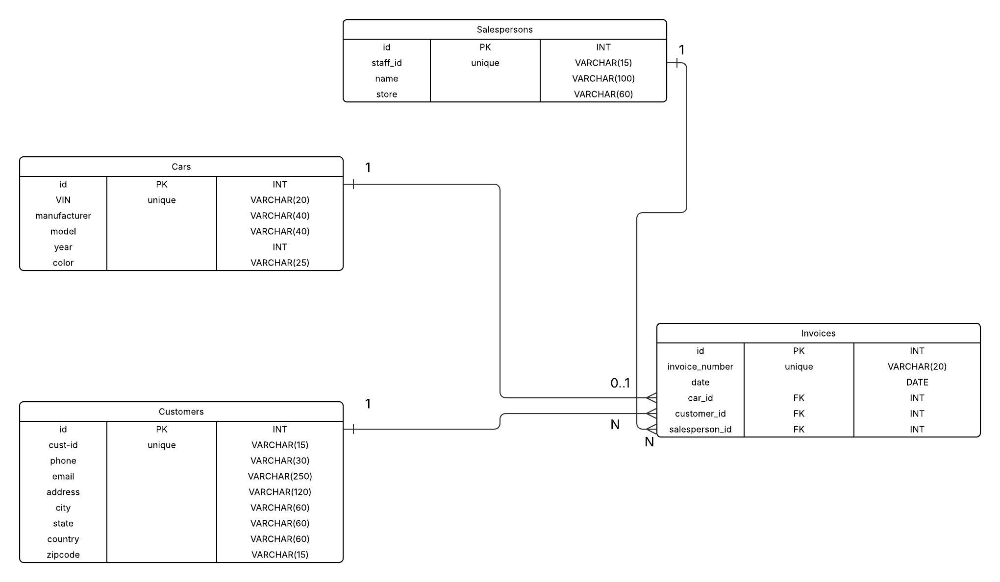

# Lab | MySQL Database Creation

## Challenge 1 - E-R Diagram

## Challenge 2 - Create the Database and Tables
SQL script: [create.sql](create.sql)

## Challenge 3 - Seeding the Database
SQL script: [seeding.sql](seeding.sql)

## Bonus Challenge - Updating and Deleting Database Records
SQL scripts: [update.sql](update.sql) and [delete.sql](delete.sql)

